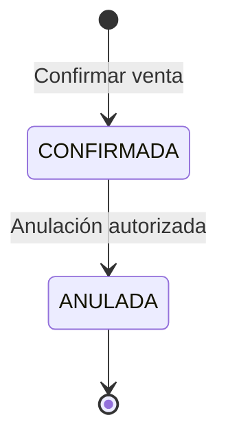
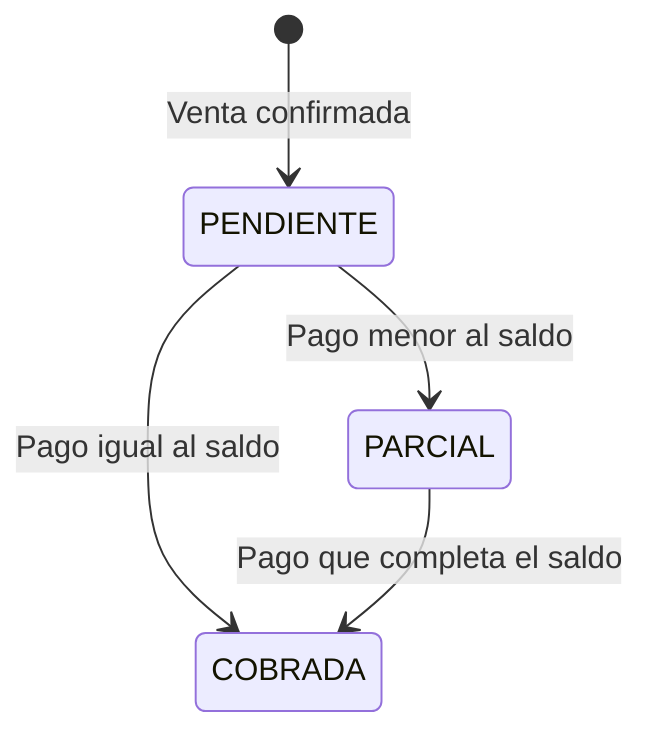
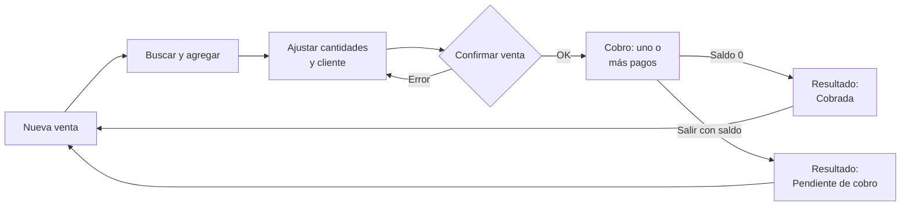
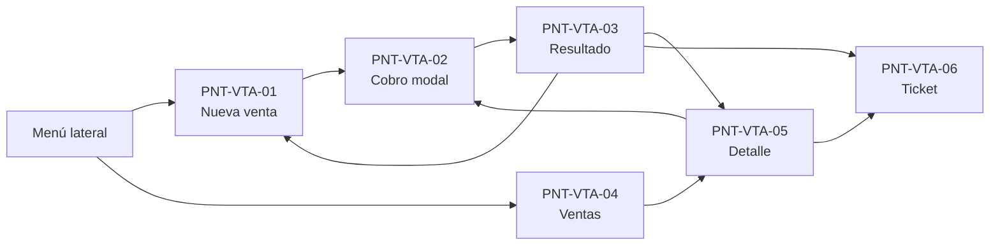

# SPEC — Módulo de Ventas

Sep 24, 2026 · @Monfasani Federico

## 1. Ficha, alcance y convenciones

Especificación funcional y de UI/UX del módulo de Ventas del POS presencial de Otra Ronda Más. Parte del estado implementado y lo lleva al comportamiento objetivo del piloto. Las reglas que dependen de una decisión del dueño **no se inventan**: quedan como `D-VTA-xx` (sección 14), con la opción propuesta marcada.

| Campo | Valor |
| --- | --- |
| Versión | v0.1 — borrador para revisión del dueño |
| Deriva de | Informe funcional — Módulo de Ventas; SPEC general SDD v0.1 (RF-05, RF-08, RF-09, RF-16); criterios D-01 a D-19; notas de scaffolding §11–§33; código leído (hallazgos C1–C29) |
| Sistema | Panel interno admin.otrarondamas.wapsell.com (`apps/pos-admin` + `apps/api`) |
| Design system | [Design System — Otra Ronda Más](https://claude.ai/artifact/4gto4VZJ6hGFiKKiujYij4) |
| Aprobación | Pendiente del dueño. Nada de esta SPEC se implementa sin aprobación de la sección 14 que lo afecte |

**Incluye:** venta presencial (canal `presencial`), búsqueda y escaneo, carrito, cliente opcional, descuentos, confirmación, cobro manual con pagos mixtos (efectivo, transferencia, QR), comprobante interno, historial, detalle, anulación y la UI de todo ese flujo.

**No incluye:** canal mayorista (D-01), pedidos online (RF-06, módulo Pedidos), Mercado Pago (D-03), cuenta corriente (RF-10: se define la integración, no el módulo), devoluciones con reembolso (D-17: solo el vínculo), facturación fiscal (SPEC general §2.2), módulo de caja y arqueos.

**Convenciones de estado** usadas en cada requisito, regla y pantalla:

- **Implementado**: ya existe en producción y se mantiene.
- **Cambio**: existe pero debe modificarse.
- **Nuevo**: no existe.
- **Bloqueado por D-VTA-xx**: no se implementa hasta que el dueño decida.

IDs: `RF-VTA` requisitos, `RN-VTA` reglas, `INV-VTA` invariantes, `CA-VTA` criterios de aceptación, `PNT-VTA` pantallas. Los hallazgos del código se citan como C1–C29 del informe.

## 2. Conceptos

Una **venta** es un registro inmutable de qué se vendió, a qué precio y a quién; el **cobro** es un conjunto de **pagos** aplicados a esa venta. El saldo se deriva, nunca se carga a mano.

| Concepto | Definición | Modelo |
| --- | --- | --- |
| Carrito | Líneas en edición en la pantalla, antes de confirmar. No existe en la base | Estado de `useCarrito` |
| Venta | Operación confirmada con número comercial, vendedor, cliente opcional, líneas y total. No se borra (INV-02) | `Venta` |
| Línea | Producto, cantidad, precio unitario congelado, descuentos y subtotal | `VentaItem` |
| Precio unitario | `precioMinorista` del producto al confirmar, congelado en la línea (INV-12) | `VentaItem.precioUnitario` |
| Descuento de fidelidad | % automático según nivel del cliente y regla vigente | `VentaItem.descuentoFidelizacionPorcentaje` |
| Descuento manual | Rebaja cargada por el vendedor, sujeta a D-VTA-03 | `VentaItem.descuentoItem` |
| Pago | Un medio y un importe aplicados a la venta | `Pago` |
| Monto recibido | Lo que el cliente entrega en efectivo; puede superar el importe aplicado | Nuevo: `Pago.montoRecibido` |
| Vuelto | Monto recibido − importe aplicado en efectivo | Derivado, se guarda en el pago |
| Saldo | Total − suma de pagos APROBADOS | Derivado |
| Estado de cobro | PENDIENTE (saldo = total), PARCIAL (0 < saldo < total), COBRADA (saldo = 0) | Derivado |
| Comprobante interno | Documento no fiscal de la venta, imprimible como ticket (RF-05) | Nuevo |
| Anulación | Operación autorizada que deja sin efecto una venta sin borrarla, con reposición de stock | Nuevo |

## 3. Actores, permisos y autorizaciones

Cada operación exige cuenta Aprobada (`LegajoAprobadoGuard`) más un permiso; las operaciones restringidas exigen además una autorización registrada de otro usuario (D-06, nunca uno mismo).

| Actor | Rol (`RolUsuario`) | Qué hace en Ventas |
| --- | --- | --- |
| Asistente de local | `ASISTENTE_LOCAL` | Vende, cobra, consulta sus ventas, pide autorizaciones |
| Dueño | `OWNER` | Todo lo anterior, consulta todas las ventas y autoriza excepciones |

| Operación | Permiso | Autorización | Estado |
| --- | --- | --- | --- |
| Buscar productos y clientes | ninguno | — | Implementado |
| Crear venta | `ventas.crear` | — | Implementado |
| Registrar pago | `ventas.crear` | — | Implementado |
| Ver historial y detalle | `ventas.ver` | — | Nuevo (hoy sin permiso, C6) |
| Descuento manual | `ventas.descuentoManual` | Según D-VTA-03 | Nuevo (hoy sin control, C1) |
| Anular venta | `ventas.anular` | Siempre | Nuevo |
| Vender con stock insuficiente | — | No permitido | Implementado (sin excepción, notas §23) |
| Reimprimir comprobante | `ventas.ver` | — | Nuevo |

Operaciones autorizables nuevas en `OPERACIONES_AUTORIZABLES`: `venta.anulacion` → `ventas.anular`; `venta.descuentoManual` → `ventas.descuentoManual` (si D-VTA-03 lo exige).

Quién puede autorizar: hoy, cualquier usuario con el permiso de la operación (notas §21); la SPEC general §3.2 dice “el dueño”. **Bloqueado por D-VTA-06.** Los permisos nuevos se asignan con `sync-permisos-owner.ts` al dueño; al Asistente de local, solo `ventas.crear` y `ventas.ver` salvo decisión contraria.

## 4. Requisitos funcionales

30 requisitos: 23 son del MVP del piloto (30/11/2026) y 7 posteriores. “Origen” cita la SPEC general o el hallazgo que lo motiva.

| ID | Requisito | Prioridad | Estado | Origen |
| --- | --- | --- | --- | --- |
| RF-VTA-01 | Iniciar una venta con carrito vacío y total $0,00 | MVP | Implementado | RF-05 |
| RF-VTA-02 | Buscar por nombre o SKU (mínimo 2 caracteres, máx. 50 resultados), **solo productos activos** | MVP | Cambio (C27) | RF-05 |
| RF-VTA-03 | Mostrar en cada resultado nombre, SKU, precio, stock disponible y categoría | MVP | Cambio | Rediseño |
| RF-VTA-04 | Agregar producto; si ya está en el carrito, sumar 1 a su línea | MVP | Implementado (C9) | — |
| RF-VTA-05 | Modificar cantidad con − / + y entrada directa, sin borrar la línea al vaciar el campo | MVP | Cambio (C26) | — |
| RF-VTA-06 | Advertir en el carrito si la cantidad supera el stock disponible, antes de confirmar | MVP | Nuevo | C26 |
| RF-VTA-07 | Quitar una línea y vaciar el carrito con confirmación | MVP | Implementado / Cambio | — |
| RF-VTA-08 | Asociar un cliente opcional de la empresa | MVP | Cambio (C10) | RF-05 |
| RF-VTA-09 | Mostrar el descuento de fidelidad **antes** de confirmar | MVP | Cambio (C20) | — |
| RF-VTA-10 | Calcular subtotal, descuentos y total en el servidor, con redondeo a 2 decimales | MVP | Cambio (C3), D-VTA-02 | RF-05 |
| RF-VTA-11 | Mostrar IVA solo si D-VTA-01 lo define | MVP | Bloqueado por D-VTA-01 | Hallazgo 1 |
| RF-VTA-12 | Confirmar venta: congelar precios, descontar stock, asignar número comercial | MVP | Cambio (C22) | RF-05 |
| RF-VTA-13 | Advertir lote vencido **antes** de confirmar, según D-VTA-05 | MVP | Cambio (C20) | D-09 |
| RF-VTA-14 | Registrar uno o más pagos hasta saldo 0 (pagos mixtos) | MVP | Implementado | RF-08 |
| RF-VTA-15 | Efectivo: cargar monto recibido y calcular vuelto | MVP | Nuevo (C19) | Rediseño |
| RF-VTA-16 | Transferencia y QR: mostrar datos de cobro desde Configuración y registrar referencia opcional | MVP | Nuevo (C16) | D-04 |
| RF-VTA-17 | Impedir iniciar otra venta con saldo pendiente sin decisión explícita | MVP | Nuevo (C18), D-VTA-04 | Hallazgo 3 |
| RF-VTA-18 | Pantalla de resultado con número, estado de cobro y acciones | MVP | Cambio | RF-05 |
| RF-VTA-19 | Comprobante interno imprimible como ticket | MVP | Nuevo | RF-05 |
| RF-VTA-20 | Historial paginado con número, fecha, vendedor, cliente, total, saldo y estado de cobro | MVP | Nuevo (C6) | RF-16 |
| RF-VTA-21 | Detalle de venta con líneas, descuentos, pagos, lotes y trazabilidad | Posterior | Nuevo | RF-16 |
| RF-VTA-22 | Retomar el cobro de una venta con saldo desde el historial | MVP | Nuevo | Hallazgo 3 |
| RF-VTA-23 | Descuento manual por línea con permiso y regla de D-VTA-03 | Posterior | Bloqueado por D-VTA-03 | C1, C2 |
| RF-VTA-24 | Anular una venta con autorización, reponiendo stock | Posterior | Bloqueado por D-VTA-09 | INV-02, INV-11 |
| RF-VTA-25 | Registrar auditoría de creación, cobro y anulación | MVP | Nuevo (C12) | RF-16 |
| RF-VTA-26 | Escanear código de barras; si no existe, avisar sin agregar | Posterior | Nuevo | Catálogo §8.3 |
| RF-VTA-27 | Vender por presentación (unidad, pack, caja) | Posterior | Nuevo (C23) | D-08 |
| RF-VTA-28 | Venta a cuenta corriente | Posterior | Nuevo (C24) | RF-10 |
| RF-VTA-29 | Mercado Pago como medio | Posterior | Bloqueado por D-03 | RF-08 |
| RF-VTA-30 | Atajos de teclado para el flujo completo sin mouse | MVP | Nuevo | Design system: eficiencia |

## 5. Reglas de negocio

Todas se validan en el servidor; la pantalla solo las anticipa. Las que dependen de una decisión muestran la opción propuesta.

**Cálculo del importe**

```latex
\text{Subtotal}_i = \text{round}_2\big(\text{precio}_i \times \text{cantidad}_i \times (1 - \text{fid}_i/100)\big) - \text{descManual}_i
```

```latex
\text{Total} = \sum_i \text{Subtotal}_i \qquad \text{Saldo} = \text{Total} - \sum \text{pagos APROBADOS}
```

| ID | Regla | Estado |
| --- | --- | --- |
| RN-VTA-01 | El precio unitario es `precioMinorista` al confirmar; el del carrito es informativo. Si cambió desde que se agregó, la pantalla lo informa en el resultado | Implementado + Cambio (alternativa A del informe) |
| RN-VTA-02 | Importes con `Prisma.Decimal`, redondeo a 2 decimales mitad hacia arriba, por línea. Nunca `Number` | Cambio (C3). Propuesta de D-VTA-02 |
| RN-VTA-03 | Ningún subtotal ni total puede ser negativo; el descuento manual no puede superar el subtotal tras fidelidad | Nuevo (C2) |
| RN-VTA-04 | Descuento de fidelidad: gana la regla de mayor %, calculada con el historial previo a la venta | Implementado |
| RN-VTA-05 | El nivel de fidelidad cuenta solo ventas **cobradas** (saldo 0) y pedidos confirmados | Cambio (C21) |
| RN-VTA-06 | Descuento manual: según D-VTA-03. Hasta que se decida, la API lo rechaza (`descuentoItem` > 0 → 403) | Cambio (C1) |
| RN-VTA-07 | Solo se venden productos activos; la API rechaza inactivos | Cambio (C5, C27) |
| RN-VTA-08 | Cantidad entera y ≥ 1 para `unidadBase = UNIDAD`; decimales solo para KILOGRAMO, LITRO y METRO | Cambio (C4). Propuesta de D-VTA-12 |
| RN-VTA-09 | Stock: se descuenta al confirmar la venta, con UPDATE condicional por lote (`cantidad >= requerida`). Sin stock, se rechaza toda la venta | Cambio (C14). Momento confirmado por D-VTA-08 |
| RN-VTA-10 | Lotes por vencimiento ascendente. Lote vencido: según D-VTA-05 (hoy advierte y vende) | Implementado; bloqueado por D-VTA-05 |
| RN-VTA-11 | El cliente, si se indica, debe pertenecer a la empresa y estar activo | Cambio (C10) |
| RN-VTA-12 | Un pago no puede superar el saldo. En efectivo, el monto recibido sí puede superarlo: se aplica el saldo y se guarda el vuelto | Implementado + Nuevo (C19) |
| RN-VTA-13 | Pago manual nace APROBADO y guarda usuario, fecha, medio, importe y referencia opcional | Implementado + Cambio (C16) |
| RN-VTA-14 | Efectivo con caja cerrada: según D-VTA-07 (propuesta: bloquear el pago en efectivo y ofrecer abrir caja) | Bloqueado por D-VTA-07 |
| RN-VTA-15 | Venta con saldo > 0 al salir: según D-VTA-04 (propuesta: confirmación explícita y queda “Pendiente de cobro” en historial) | Bloqueado por D-VTA-04 |
| RN-VTA-16 | Anulación: repone stock en los mismos lotes, marca pagos para reembolso (D-17) y no borra nada | Bloqueado por D-VTA-09 |
| RN-VTA-17 | IVA: no se calcula ni se muestra hasta D-VTA-01 | Bloqueado por D-VTA-01 |
| RN-VTA-18 | Toda escritura (venta, pago, anulación) genera `AuditLog` en la misma transacción | Nuevo (C12) |

## 6. Estados

La venta tiene dos estados persistidos (CONFIRMADA, ANULADA) y un estado de cobro derivado del saldo. Separarlos evita guardar un dato que puede desincronizarse de los pagos.

**Venta (persistido)**



La edición del carrito no es un estado de la venta: la venta no existe hasta confirmar. `Venta.estado` pasa de texto libre a enum `EstadoVenta { CONFIRMADA, ANULADA }` (C11).

**Cobro (derivado)**



| Estado de cobro | Condición | Etiqueta en UI | Color (design system) |
| --- | --- | --- | --- |
| PENDIENTE | Saldo = total | Pendiente de cobro | Advertencia #D97706 |
| PARCIAL | 0 < saldo < total | Cobro parcial | Advertencia #D97706 |
| COBRADA | Saldo = 0 | Cobrada | Éxito #16803C |
| (ANULADA) | Venta anulada | Anulada | Peligro #DC2626 |

**Pago (SPEC §6.2, enum `EstadoPago` existente):** los pagos manuales nacen APROBADO. PENDIENTE, EN\_PROCESO y RECHAZADO quedan para Mercado Pago (D-03). Al anular una venta, sus pagos pasan a REEMBOLSADO\_TOTAL cuando se registra el reembolso (D-17).

## 7. Flujos

El flujo principal tiene tres momentos — armar, confirmar, cobrar — y termina en una pantalla de resultado; nunca vuelve a Nueva venta sin mostrar qué quedó registrado.



**Flujo principal (FP)**

1. El vendedor abre Nueva venta. Si la caja está cerrada, ve un aviso con acceso a abrirla (D-VTA-07).
2. Busca por nombre o SKU (o escanea) y agrega productos; cada resultado muestra precio y stock.
3. Ajusta cantidades; el carrito advierte si alguna supera el stock o sale de un lote vencido.
4. Opcionalmente elige un cliente; el resumen muestra el descuento de fidelidad aplicable.
5. Revisa el resumen y confirma. El servidor congela precios, descuenta stock y asigna número.
6. Se abre el cobro con el saldo. Registra uno o más pagos hasta saldo 0.
7. Ve el resultado “Cobrada” con número de venta y acciones: imprimir ticket, ver venta, nueva venta.

**Flujos alternativos**

| ID | Disparador | Comportamiento |
| --- | --- | --- |
| FA-01 | Búsqueda sin resultados | Mensaje “Sin resultados para ‘x’” y sugerencia de buscar por SKU |
| FA-02 | Código escaneado no identificado | Aviso no bloqueante; no se agrega línea; opción de avisar al dueño |
| FA-03 | Stock insuficiente al confirmar | Rechazo; el carrito marca la línea con el disponible real; la venta no se crea |
| FA-04 | Precio cambió entre carrito y confirmación | Venta con precio vigente; el resultado indica “precio actualizado” por línea |
| FA-05 | Pago mixto | Tras cada pago, el saldo se recalcula y el modal sigue abierto hasta 0 |
| FA-06 | Transferencia no acreditada | El vendedor no registra el pago; puede cambiar de medio o salir con saldo (D-VTA-04) |
| FA-07 | Salir con saldo pendiente | Confirmación “La venta queda pendiente de cobro”; aparece en el historial para retomar (RF-VTA-22) |
| FA-08 | Error de red al confirmar | No se reintenta solo; se consulta por clave de idempotencia para no duplicar la venta (INV-VTA-07) |
| FA-09 | Anulación | Desde el detalle; pide motivo y credenciales de un autorizador; repone stock (D-VTA-09) |
| FA-10 | Salir de la pantalla con carrito cargado | Aviso “Se perderán los productos cargados” (D-VTA-14) |

## 8. Contratos de API

Se mantienen las rutas existentes y se agregan tres: búsqueda para venta, cotización previa y comprobante. La cotización resuelve que el vendedor vea el total real antes de confirmar (C20). Importes siempre como string decimal con 2 decimales.

| Método y ruta | Permiso | Estado | Propósito |
| --- | --- | --- | --- |
| `GET /ventas/productos?search=` | `ventas.crear` | Nuevo | Búsqueda del POS: solo activos, con precio, stock disponible, familia/subfamilia y `tieneLoteVencido` |
| `POST /ventas/cotizacion` | `ventas.crear` | Nuevo | Calcula líneas, descuentos, total y advertencias sin guardar nada |
| `POST /ventas` | `ventas.crear` | Cambio | Confirma la venta |
| `POST /ventas/:id/pagos` | `ventas.crear` | Cambio | Registra un pago |
| `GET /ventas` | `ventas.ver` | Cambio | Historial paginado y filtrable |
| `GET /ventas/:id` | `ventas.ver` | Cambio | Detalle completo |
| `GET /ventas/:id/comprobante` | `ventas.ver` | Nuevo | Datos del ticket |
| `POST /ventas/:id/anulacion` | `ventas.anular` | Nuevo, bloqueado por D-VTA-09 | Anula con autorización |

**`POST /ventas` y `POST /ventas/cotizacion`** — mismo cuerpo:

```json
{
  "canal": "presencial",
  "clienteId": "uuid | null",
  "idempotencyKey": "uuid generado por la pantalla al abrir el carrito",
  "items": [
    { "productoId": "uuid", "cantidad": "2", "descuentoItem": "0.00" }
  ]
}
```

Respuesta de confirmación (la cotización devuelve lo mismo sin `id`, `numero` ni `saldo`):

```json
{
  "id": "uuid",
  "numero": 125,
  "numeroFormateado": "#00000125",
  "estado": "CONFIRMADA",
  "estadoCobro": "PENDIENTE",
  "subtotal": "4900.00",
  "descuentoFidelidad": "490.00",
  "descuentoManual": "0.00",
  "total": "4410.00",
  "saldo": "4410.00",
  "items": [
    { "productoId": "uuid", "nombre": "LAYS CLASICAS 170G", "codigoInterno": "SNA-PAP-GEN-GEN-00000321",
      "cantidad": "2", "precioUnitario": "2450.00", "descuentoFidelizacionPorcentaje": "10.00",
      "subtotal": "4410.00", "precioActualizado": false }
  ],
  "advertencias": { "lotesVencidos": [], "preciosActualizados": [] }
}
```

El SKU del ejemplo es ilustrativo del formato, no un producto real.

**`POST /ventas/:id/pagos`**

```json
{ "medio": "efectivo", "monto": "4410.00", "montoRecibido": "5000.00", "referencia": null }
```

Respuesta: `{ pago, vuelto: "590.00", saldo: "0.00", estadoCobro: "COBRADA" }`. `montoRecibido` solo en efectivo y ≥ `monto`; `referencia` solo en transferencia y QR, hasta 64 caracteres.

**`GET /ventas`** — filtros `desde`, `hasta`, `estadoCobro`, `usuarioId`, `clienteId`, `numero`; `page` y `pageSize` (máx. 50). Cada fila: `id`, `numeroFormateado`, `createdAt`, `vendedor`, `cliente`, `total`, `saldo`, `estadoCobro`, `estado`, `medios`.

**Formato de error**, igual para todos: `{ "codigo": "STOCK_INSUFICIENTE", "mensaje": "texto para mostrar", "detalle": { ... } }`. Los códigos están en la sección 12.

## 9. Cambios de modelo de datos

Siete migraciones aditivas, sin borrar columnas ni datos. Todas siguen el patrón backup → ensayo sobre copia → migración usado en producción (notas §34).

| Modelo | Cambio | Motivo | Migración de datos |
| --- | --- | --- | --- |
| `Venta` | `numero Int` + `@@unique([empresaId, numero])`, asignado por secuencia por empresa dentro de la transacción | Número comercial (C22) | Numerar ventas existentes por `createdAt` |
| `Venta` | `estado` a enum `EstadoVenta`; `canal` a enum | C11 | Mapear valores actuales (todos CONFIRMADA) |
| `Venta` | `idempotencyKey String?` + `@@unique([empresaId, idempotencyKey])` | Evitar ventas duplicadas por reintento (FA-08) | Nulos para existentes |
| `Venta` | `anuladaEn`, `anuladaPorId`, `motivoAnulacion`, `autorizacionAnulacionId` | Anulación (RF-VTA-24) | — |
| `Pago` | `montoRecibido Decimal?`, `vuelto Decimal?`, `referencia String?` | C16, C19 | — |
| `Autorizacion` | `solicitanteId`, `resultado` | D-06 pide ambos (C25) | Existentes: solicitante null, resultado APROBADA |
| Importes | `@db.Decimal(14, 2)` en `Venta.total`, `VentaItem.precioUnitario`, `descuentoItem`, `Pago.monto`; cantidades `@db.Decimal(12, 3)` | C3 | Redondeo a 2 decimales de históricos, **bloqueado por D-VTA-02** |

**Integridad multiempresa (C10):** agregar `@@unique([empresaId, id])` en `Cliente` y cambiar la FK de `Venta` a `(empresaId, clienteId) → Cliente(empresaId, id)`. Así la base impide vincular un cliente de otra empresa aunque falle el service. Mismo criterio para `VentaItem.productoId` si se agrega `empresaId` a `VentaItem`.

**Fuera de este incremento:** `VentaItem.presentacionId` (RF-VTA-27, requiere que `Presentacion.factorConversion` pase a opcional, C23) y el uso de `Deuda`/`AplicacionPago` para cuenta corriente (RF-VTA-28, C24).

## 10. Invariantes

Condiciones que deben cumplirse siempre, protegidas en servidor y base de datos; cada una tiene al menos un test automatizado.

| ID | Invariante | Deriva de | Dónde se protege |
| --- | --- | --- | --- |
| INV-VTA-01 | Una venta confirmada nunca se borra; solo puede pasar a ANULADA | INV-02 | Sin `DELETE` en API; enum de estado |
| INV-VTA-02 | Toda venta y sus líneas, pagos y cliente pertenecen a la misma empresa | INV-01 | FK compuesta con `empresaId` + extension de scope |
| INV-VTA-03 | Ningún lote queda con cantidad negativa | INV-06 | UPDATE condicional + `CHECK (cantidad >= 0)` en `Lote` |
| INV-VTA-04 | Suma de pagos APROBADOS ≤ total de la venta | INV-04 | Transacción con bloqueo de la fila de la venta (`SELECT ... FOR UPDATE`) |
| INV-VTA-05 | Total = suma de subtotales redondeados; ningún subtotal < 0 | RN-VTA-02, RN-VTA-03 | Service + `CHECK (total >= 0)` |
| INV-VTA-06 | El precio de una línea no cambia después de confirmada | INV-12 | Sin endpoint de edición de líneas |
| INV-VTA-07 | Una misma `idempotencyKey` crea como máximo una venta por empresa | INV-13 | Índice único |
| INV-VTA-08 | Cada salida de stock por venta queda en `MovimientoStock` con venta, lote y usuario | INV-03 | Misma transacción que la venta |
| INV-VTA-09 | Toda operación restringida tiene una `Autorizacion` con autorizador distinto del solicitante | INV-09, D-06 | `AutorizacionesService` |
| INV-VTA-10 | Toda escritura del módulo tiene su `AuditLog` | RF-16 | Misma transacción |
| INV-VTA-11 | El número comercial es único y correlativo por empresa, sin reutilizarse | — | Secuencia + índice único |

## 11. UI/UX

La UI parte del rediseño de 7 pantallas y lo corrige para que coincida con el backend y con esta SPEC. Todo valor visual sale del [design system](https://claude.ai/artifact/4gto4VZJ6hGFiKKiujYij4); no se definen colores ni tipografías nuevas.

### 11.1 Principios y valores visuales

Cuatro principios del design system gobiernan la pantalla de venta: claridad operativa, eficiencia (layout de dos zonas catálogo + carrito), consistencia y accesibilidad WCAG 2.1 AA. Los valores de abajo son los del README del design system; en código se usan sus tokens de `tokens.json`, nunca valores sueltos.

| Uso en Ventas | Valor |
| --- | --- |
| Fondo general | #F5F5F2 |
| Cards (búsqueda, carrito, resumen, cliente) y modales | #FFFFFF, radio 8px, sombra md |
| Sidebar | #111111 |
| Acción primaria (Confirmar venta, Registrar pago, Nueva venta) e ítem activo del menú | Amarillo #F9D82E con texto #171717 |
| Texto principal / secundario | #171717 / #666666 |
| Bordes y separadores | #E8E8E3 |
| Cobrada, vuelto | Éxito #16803C |
| Pendiente de cobro, stock bajo, lote vencido, precio actualizado | Advertencia #D97706 |
| Anulada, stock insuficiente, errores | Peligro #DC2626 |
| Avisos informativos (verificar transferencia) | Información #2563EB |
| Tipografía | Inter 400–700 |
| Título de página | Display Large 32/40 700 |
| Título de card | Heading Small 18/26 600 |
| Texto de línea y etiquetas | Body Medium 14/22 400; Label Large 14/20 600 |
| Precios, SKU, cantidades, totales | Mono Medium 13/20 500; total general en Heading Large 24/32 700 |
| Espaciado | 8, 12, 16, 24 y 32px; padding de card 16px; separación entre cards 24px |

Botón primario deshabilitado: no usar amarillo con opacidad sobre texto oscuro, que no llega a 4.5:1; usar fondo #F0F0EC, texto #666666 y borde #E8E8E3. Cada estado de color va acompañado de texto o ícono, nunca solo color.

### 11.2 Pantallas y navegación

Seis pantallas, todas dentro del panel con sidebar. “Nueva venta” y “Ventas” son ítems separados del menú; hoy el menú no tiene historial.



| ID | Pantalla | Ruta | Estado |
| --- | --- | --- | --- |
| PNT-VTA-01 | Nueva venta | `/ventas/nueva` | Cambio (rediseño + correcciones) |
| PNT-VTA-02 | Cobro | Modal sobre 01 o 05 | Cambio |
| PNT-VTA-03 | Resultado | Modal sobre 01 | Cambio |
| PNT-VTA-04 | Ventas (historial) | `/ventas` | Nuevo |
| PNT-VTA-05 | Detalle de venta | `/ventas/:id` | Nuevo |
| PNT-VTA-06 | Comprobante / ticket | Vista de impresión | Nuevo |

El breadcrumb sigue el patrón del rediseño: “Ventas › Nueva venta”, “Ventas › #00000125”.

### 11.3 PNT-VTA-01 — Nueva venta

Dos columnas en desktop: a la izquierda (≈ 2/3) buscar y carrito; a la derecha (≈ 1/3, fija al hacer scroll) resumen y cliente. El resumen siempre muestra el total **cotizado por el servidor**, no uno calculado en la pantalla.

```text
┌─ Ventas › Nueva venta ───────────────────────────── [Caja abierta ●] [Limpiar] ┐
│ Nueva venta                                                                  │
├─ Buscar producto ────────────────────────────┐ ┌─ Resumen de venta ──────────┐ │
│ [🔍 Nombre, SKU o escaneá (F2)   ] [Familia ▾] │ │ Subtotal        $4.900,00   │ │
│   resultados: nombre · SKU · precio · stock  │ │ Desc. fidelidad   −$490,00  │ │
├─ Carrito (2) ───────────────────── [Vaciar] ┤ │ TOTAL           $4.410,00   │ │
│ Producto        Precio   Cant.    Subtotal    │ │ [ Confirmar venta  (F9) ]   │ │
│ LAYS 170G       2.450,00 [− 2 +]  4.410,00 🗑 │ ├─ Cliente ───────────────────┤ │
│   ⚠ Stock disponible: 1                        │ │ [Consumidor final   ▾]    │ │
└──────────────────────────────────────────────┘ │ Nivel: VIP · 10% fidelidad │ │
                                                └────────────────────────────┘ │
```

| Componente | Comportamiento |
| --- | --- |
| Indicador de caja | Chip en el encabezado: “Caja abierta” (éxito) o “Caja cerrada · Abrir” (advertencia, enlace a Caja). Se consulta al montar la pantalla |
| Buscador | Foco automático al abrir y tras cada agregado. Debounce 300 ms, desde 2 caracteres. Enter con un único resultado, o con un código escaneado exacto, lo agrega directo |
| Resultado de búsqueda | Nombre, SKU en mono, familia › subfamilia, precio, “Stock: N” (advertencia si ≤ stock mínimo, peligro si 0). Sin stock: fila deshabilitada con “Sin stock”. Con lote vencido: etiqueta “Lote vencido” |
| Línea del carrito | Nombre + SKU, precio unitario, stepper − / cantidad / +, subtotal, quitar. El campo vacío se restaura al perder el foco; nunca elimina la línea. Advertencia inline si supera el stock |
| Vaciar / Limpiar | Piden confirmación si hay líneas: “¿Vaciar el carrito? Se quitan N productos.” |
| Resumen | Subtotal, descuento de fidelidad (solo si > 0), descuento manual (solo si existe), total. Se actualiza con `POST /ventas/cotizacion` 300 ms después del último cambio. Sin línea de IVA hasta D-VTA-01 |
| Confirmar venta | Deshabilitado sin líneas, con cotización en curso o con líneas sin stock. Muestra “Confirmando…” y bloquea doble clic |
| Cliente | Selector con búsqueda (nombre o email) y “+ Agregar cliente” si tiene `clientes.gestionar`. Al elegir, muestra nivel y % de fidelidad |

| Estado de pantalla | Qué se ve |
| --- | --- |
| Vacía | Carrito con ilustración “Tu carrito está vacío · Buscá un producto para comenzar la venta”; resumen en $0,00; Confirmar deshabilitado |
| Buscando | Spinner en el campo; resultados previos atenuados |
| Sin resultados | “Sin resultados para ‘xyz’. Probá con el SKU o menos letras.” |
| Error de búsqueda | “No se pudo buscar. Reintentar.” con botón |
| Cotizando | Total atenuado con “Actualizando…” |
| Error al confirmar | Banner de peligro arriba del carrito con el mensaje de la sección 12; líneas afectadas marcadas; carrito intacto |

### 11.4 PNT-VTA-02 — Cobro

El cobro reemplaza el asistente de 3 pasos del rediseño por un modal de un solo panel con saldo y lista de pagos, porque el asistente no admite pagos mixtos. La venta ya está confirmada cuando se abre: el encabezado lo dice.

```text
┌─ Cobrar venta #00000125 · Confirmada ──────────────────────── [×] ┐
│ Total $18.146,71    Pagado $10.000,00    SALDO $8.146,71        │
│ ── Pagos registrados ──                                          │
│ Transferencia  $10.000,00  ref. 4411…  14:31                      │
│ ── Nuevo pago ──                                                  │
│ [Efectivo] [Transferencia] [QR]                                  │
│ Importe a aplicar [ 8.146,71 ]  (precargado con el saldo)        │
│ Monto recibido    [ 10.000,00 ] [$9.000][$10.000][$11.000]       │
│ Vuelto            $1.853,29                                      │
│                              [ Registrar pago  (F9) ]            │
│ [Dejar pendiente de cobro]                                       │
└────────────────────────────────────────────────────────────────┘
```

| Medio | Campos | Comportamiento |
| --- | --- | --- |
| Efectivo | Importe a aplicar (precargado con el saldo), monto recibido, montos rápidos | Montos rápidos: los tres múltiplos de $1.000 inmediatamente superiores al importe. Vuelto calculado en vivo en verde. Si recibido < importe: “Falta $X” en peligro y botón deshabilitado. Con caja cerrada: bloqueado según D-VTA-07 con enlace a abrir caja |
| Transferencia | Importe, datos de cobro (titular, alias, CBU/CVU con copiar) desde Configuración, referencia opcional | Aviso informativo fijo: “Registrá el pago solo después de ver el dinero acreditado en la cuenta del comercio.” |
| QR | Importe, QR generado desde Configuración, instrucciones, referencia opcional | Mismo aviso. El QR es estático hasta que exista integración (D-04) |

- Tras cada pago: el pago se suma a la lista, el saldo baja y el importe se precarga con el nuevo saldo.
- Con saldo 0 el modal pasa solo a PNT-VTA-03.
- “Dejar pendiente de cobro” y la × con saldo > 0 abren una confirmación según D-VTA-04: “La venta #00000125 queda pendiente de cobro por $8.146,71. Podés retomarla desde Ventas.”
- Los datos bancarios nunca están fijos en la pantalla: si Configuración no los tiene, el medio se muestra deshabilitado con “Configurá los datos de cobro”.
- El mismo modal se abre desde el detalle de una venta con saldo (RF-VTA-22).

### 11.5 PNT-VTA-03 — Resultado y PNT-VTA-06 — Ticket

El resultado confirma en una sola vista qué quedó registrado: número, estado de cobro, productos, descuentos, pagos y vuelto. Se basa en el rediseño “¡Venta confirmada!” con tres cambios: estado de cobro real, pagos detallados y advertencias.

| Elemento | Contenido |
| --- | --- |
| Encabezado | Cobrada: check verde + “Venta cobrada”. Pendiente o parcial: reloj ámbar + “Venta pendiente de cobro”. Sin confeti en el caso pendiente |
| Datos | Nº de venta `#00000125`, fecha y hora, vendedor, cliente, estado de cobro (chip) |
| Productos | Nombre, SKU, precio unitario, cantidad, subtotal; etiqueta “Precio actualizado” si cambió respecto del carrito |
| Totales | Subtotal, descuento de fidelidad, descuento manual, total; IVA solo según D-VTA-01 |
| Pagos | Un renglón por pago: medio, importe, referencia; en efectivo, recibido y vuelto. Saldo si > 0 |
| Advertencias | “Se vendió stock de un lote vencido: …” (si D-VTA-05 lo permite) |
| Acciones | Imprimir ticket (F8) · Ver venta · **Nueva venta** (primario, Enter). Si hay saldo: “Cobrar saldo” reemplaza a Nueva venta como primario |

**Ticket (PNT-VTA-06):** vista de impresión de 80 mm, monocromo, Inter o fuente del sistema. Contiene nombre del comercio, “Comprobante interno — no válido como factura”, número, fecha, vendedor, cliente si hay, líneas, descuentos, total, pagos, vuelto y saldo. El modelo de impresora y el método de impresión dependen de D-14; hasta entonces se imprime con el diálogo del navegador.

### 11.6 PNT-VTA-04 — Ventas y PNT-VTA-05 — Detalle

El historial resuelve la “venta que desaparece”: toda venta confirmada es consultable y las pendientes de cobro están a un clic.

**Historial (PNT-VTA-04)**

- Encabezado con tres indicadores del día: cantidad de ventas, total vendido y total pendiente de cobro.
- Filtros: rango de fechas (default: hoy), estado de cobro (chips Todas · Pendientes · Cobradas · Anuladas), vendedor, cliente, búsqueda por número.
- Tabla paginada de 25 filas, más recientes primero.

| Columna | Formato |
| --- | --- |
| Nº | `#00000125`, mono, enlace al detalle |
| Fecha y hora | dd/mm/aaaa hh:mm |
| Vendedor | Nombre |
| Cliente | Nombre o “Consumidor final” |
| Medios | Íconos con etiqueta accesible |
| Total | Mono, alineado a la derecha |
| Saldo | Mono; en ámbar si > 0 |
| Estado | Chip: Cobrada / Pendiente / Parcial / Anulada |
| Acción | “Cobrar” si hay saldo |

Vacío: “No hay ventas en este período.” Alcance para el Asistente de local (todas o solo las propias): D-VTA-13.

**Detalle (PNT-VTA-05)**

Cabecera (número, estado, cobro, fecha, vendedor, cliente) y cuatro bloques: productos (con lote y marca de vencido), totales, pagos, trazabilidad (creada, cobros, anulación y autorizaciones con usuario y hora). Acciones: Cobrar saldo · Reimprimir ticket · Anular (solo con `ventas.anular`, bloqueado por D-VTA-09).

### 11.7 Microcopy

Voseo rioplatense, verbos en imperativo en los botones, sin jerga técnica (nunca “UUID”, “400” ni “transacción”). Importes con formato argentino: `$18.146,71`.

| Lugar | Texto |
| --- | --- |
| Subtítulo de Nueva venta | Buscá productos y agregalos al carrito para completar la venta. |
| Placeholder del buscador | Nombre, SKU o escaneá el código |
| Carrito vacío | Tu carrito está vacío · Buscá un producto para comenzar la venta. |
| Stock excedido en línea | Solo hay {n} disponibles. |
| Sin stock en resultado | Sin stock |
| Lote vencido (antes de confirmar) | Parte de este producto sale de un lote vencido. |
| Botón principal del resumen | Confirmar venta |
| Confirmando | Confirmando… |
| Encabezado del cobro | Cobrar venta #{número} · Confirmada |
| Aviso de transferencia | Registrá el pago solo después de ver el dinero acreditado en la cuenta del comercio. |
| Falta en efectivo | Falta {importe} para cubrir este pago. |
| Caja cerrada | La caja está cerrada. Abrila para cobrar en efectivo. |
| Dejar pendiente | La venta #{número} queda pendiente de cobro por {saldo}. Podés retomarla desde Ventas. |
| Resultado cobrado | Venta cobrada |
| Resultado pendiente | Venta pendiente de cobro |
| Precio actualizado | El precio cambió desde que lo agregaste: se cobró {precio}. |
| Vaciar carrito | ¿Vaciar el carrito? Se quitan {n} productos. · \[Cancelar\] \[Vaciar\] |
| Salir con carrito | Si salís ahora se pierden los productos cargados. · \[Seguir vendiendo\] \[Salir\] |

### 11.8 Teclado, accesibilidad y responsive

Una venta completa tiene que poder hacerse sin mouse, con lector de códigos o teclado.

| Tecla | Acción | Contexto |
| --- | --- | --- |
| F2 | Foco en el buscador | Nueva venta |
| Enter | Agregar resultado resaltado o código exacto | Buscador |
| ↑ / ↓ | Moverse por los resultados | Buscador |
| + / − | Cambiar cantidad de la línea con foco | Carrito |
| Supr | Quitar la línea con foco | Carrito |
| F9 | Confirmar venta / Registrar pago | Resumen / Cobro |
| F8 | Imprimir ticket | Resultado |
| Esc | Cerrar modal (con confirmación si hay saldo) | Modales |

**Accesibilidad (WCAG 2.1 AA):**

- Contraste de texto ≥ 4.5:1 en todos los estados, incluido el botón deshabilitado (11.1).
- Foco visible de 2px en todos los controles; el orden de tabulación sigue la lectura: buscador, carrito, cliente, resumen.
- Los cambios de total, saldo y errores se anuncian con `aria-live="polite"`; los errores de confirmación con `role="alert"`.
- El stepper de cantidad tiene etiqueta “Cantidad de {producto}”; los íconos de quitar y copiar tienen texto accesible.
- Estados nunca solo por color: chip con texto e ícono.
- Objetivos táctiles de 44 × 44 px en tablet y móvil.

**Responsive:**

| Ancho | Layout |
| --- | --- |
| ≥ 1280 px | Dos columnas 2/3 + 1/3, sidebar fijo |
| 768–1279 px | Sidebar colapsado a íconos; dos columnas 3/5 + 2/5 |
| < 768 px | Una columna: buscador, carrito, cliente; resumen como barra fija inferior con total y “Confirmar venta”; modales a pantalla completa; carrito como tarjetas en vez de tabla |

### 11.9 Correcciones sobre el rediseño

Diez cambios sobre las 7 pantallas del rediseño, antes de pasarlas a código.

| # | En el rediseño | En esta SPEC | Motivo |
| --- | --- | --- | --- |
| 1 | Resumen con “IVA (21%)” sumado al subtotal | Sin línea de IVA hasta D-VTA-01 | El backend no calcula IVA; el total no coincidiría |
| 2 | Subtotal $15.000,28 para líneas que suman $14.997,28 | Totales siempre de la cotización del servidor | Error de suma; C3 |
| 3 | Cobro en asistente de 3 pasos, un solo medio | Modal de un panel con pagos mixtos | Regresión frente a lo implementado |
| 4 | Paso activo 1 mostrando contenido del paso 2 (alias/CBU) | Sin pasos | Inconsistencia |
| 5 | Resultado “Pagada” sin detalle de pagos | Estado de cobro real, pagos, vuelto y saldo | Hallazgo 3 |
| 6 | Datos bancarios fijos en la pantalla | Desde Configuración de la empresa | RF-01 |
| 7 | SKU con 3 segmentos (GOL-BOM-GEN-00000321) | 4 segmentos `FAM-SUB-TIP-SUBT-NNNNNNNN` | Formato real (notas §31) |
| 8 | Resultados sin estado del producto | Stock con color, “Sin stock”, “Lote vencido” | C27 |
| 9 | Botón “Confirmar venta” deshabilitado en amarillo translúcido | Gris con contraste AA | WCAG |
| 10 | “LAYS CLASCAS”; mismo ícono para Pedidos e Inventario | Datos reales; íconos distintos | Typo; claridad operativa |

## 12. Errores y mensajes

Cada error tiene un código estable que la pantalla traduce a un mensaje y a una ubicación; el texto del servidor nunca se muestra crudo.

| Código | HTTP | Cuándo | Mensaje en pantalla | Dónde |
| --- | --- | --- | --- | --- |
| `STOCK_INSUFICIENTE` | 409 | Alguna línea supera el stock al confirmar | No alcanza el stock de {producto}: hay {n} disponibles. | Banner + línea marcada |
| `PRODUCTO_INACTIVO` | 422 | Producto desactivado | {producto} ya no está a la venta. Quitalo del carrito. | Banner + línea |
| `PRODUCTO_NO_ENCONTRADO` | 404 | Id inexistente o de otra empresa | Un producto del carrito ya no existe. Quitalo para continuar. | Banner |
| `CLIENTE_NO_ENCONTRADO` | 404 | Cliente inexistente, inactivo o de otra empresa | El cliente elegido no está disponible. Elegí otro o vendé sin cliente. | Card Cliente |
| `CANTIDAD_INVALIDA` | 400 | Decimal en producto por unidad, o ≤ 0 | La cantidad tiene que ser un número entero mayor a 0. | Línea |
| `DESCUENTO_NO_AUTORIZADO` | 403 | Descuento manual sin permiso o autorización | No tenés permiso para aplicar descuentos. | Línea |
| `DESCUENTO_EXCEDE_SUBTOTAL` | 400 | Descuento mayor al subtotal | El descuento no puede superar el subtotal de la línea. | Línea |
| `VENTA_DUPLICADA` | 409 | Misma `idempotencyKey` | (Sin mensaje) se muestra la venta ya creada | — |
| `PAGO_EXCEDE_SALDO` | 400 | Importe mayor al saldo | El importe supera el saldo de {saldo}. | Campo importe |
| `MONTO_RECIBIDO_INSUFICIENTE` | 400 | Recibido menor al importe en efectivo | Falta {importe} para cubrir este pago. | Campo recibido |
| `CAJA_CERRADA` | 409 | Efectivo sin caja abierta (si D-VTA-07 lo bloquea) | La caja está cerrada. Abrila para cobrar en efectivo. | Modal de cobro |
| `VENTA_ANULADA` | 409 | Pago o anulación sobre una venta anulada | Esta venta está anulada. | Modal |
| `SIN_PERMISO` | 403 | Falta el permiso de la operación | No tenés permiso para hacer esto. Pedile acceso al dueño. | Banner |
| `LEGAJO_PENDIENTE` | 403 | Cuenta sin aprobar | Tu cuenta todavía no fue aprobada. | Pantalla completa |
| Red / 5xx | — | Sin respuesta | No se pudo conectar. Revisá la conexión y reintentá. | Banner con Reintentar |

## 13. Criterios de aceptación

18 criterios verificables; cada uno se convierte en un test e2e o de API. Los bloqueados se escriben cuando se resuelve su decisión.

| ID | Dado | Cuando | Entonces | Cubre |
| --- | --- | --- | --- | --- |
| CA-VTA-01 | Un producto inactivo que contiene “lay” | Busco “lay” en el POS | No aparece en los resultados | RF-VTA-02, RN-VTA-07 |
| CA-VTA-02 | Un producto inactivo | Llamo a `POST /ventas` con él | 422 `PRODUCTO_INACTIVO`, sin venta ni movimiento de stock | RN-VTA-07 |
| CA-VTA-03 | Un producto en el carrito con cantidad 2 | Agrego el mismo producto | La línea pasa a 3 y no hay línea nueva | RF-VTA-04 |
| CA-VTA-04 | Una línea con cantidad 3 | Vacío el campo y salgo del foco | La línea vuelve a 3 y sigue en el carrito | RF-VTA-05 |
| CA-VTA-05 | Un cliente VIP con una regla del 10% | Lo selecciono antes de confirmar | El resumen muestra el descuento y el total que luego registra la venta | RF-VTA-09 |
| CA-VTA-06 | Dos líneas de $2.450,00 × 2 y $7.247,28 × 1 | Confirmo | Total $12.147,28 exacto, guardado con 2 decimales | RN-VTA-02 |
| CA-VTA-07 | Un lote con 1 unidad | Envío dos ventas simultáneas de 1 unidad | Una se confirma y la otra falla con `STOCK_INSUFICIENTE`; el lote queda en 0 | INV-VTA-03 |
| CA-VTA-08 | Un `clienteId` de otra empresa | Confirmo una venta con él | 404 `CLIENTE_NO_ENCONTRADO` y la base rechaza el vínculo aunque se saltee el service | INV-VTA-02 |
| CA-VTA-09 | `descuentoItem` > 0 sin permiso | Confirmo | 403 `DESCUENTO_NO_AUTORIZADO` | RN-VTA-06 |
| CA-VTA-10 | Una venta de $18.146,71 | Pago $10.000,00 por transferencia y $8.146,71 en efectivo con $10.000,00 recibidos | Dos pagos APROBADOS, vuelto $1.853,29, estado Cobrada | RF-VTA-14, RF-VTA-15 |
| CA-VTA-11 | Una venta con saldo 0 | Intento registrar otro pago | 400 `PAGO_EXCEDE_SALDO` y no se crea el pago | INV-VTA-04 |
| CA-VTA-12 | Una venta con saldo > 0 | Presiono “Dejar pendiente de cobro” y confirmo | Aparece en Ventas con chip Pendiente y acción Cobrar | RF-VTA-17, RF-VTA-22 |
| CA-VTA-13 | Una venta confirmada | Consulto el historial | Veo número `#000000NN` correlativo, saldo y estado de cobro | RF-VTA-20 |
| CA-VTA-14 | Un usuario sin `ventas.ver` | Llamo a `GET /ventas` | 403 `SIN_PERMISO` | RF-VTA-20 |
| CA-VTA-15 | Un reintento con la misma `idempotencyKey` | Llamo dos veces a `POST /ventas` | Una sola venta y un solo descuento de stock | INV-VTA-07 |
| CA-VTA-16 | Una venta y un pago creados | Consulto `AuditLog` | Hay un registro por cada escritura con usuario y valores | RF-VTA-25 |
| CA-VTA-17 | La pantalla de Nueva venta | La recorro solo con teclado (F2, Enter, F9) | Completo venta y cobro sin mouse | RF-VTA-30 |
| CA-VTA-18 | Cualquier pantalla del módulo | Corro un auditor de contraste | Ningún texto por debajo de 4.5:1 | 11.1, 11.8 |

## 14. Decisiones pendientes

14 decisiones del dueño; D-VTA-01, 02, 04, 05 y 07 bloquean requisitos del MVP. Cada una tiene una propuesta que respeta lo ya decidido y no inventa datos comerciales. Marcá la columna Decisión a medida que se resuelvan.

| ID | Pregunta | Opciones | Propuesta | Bloquea | Decisión |
| --- | --- | --- | --- | --- | --- |
| D-VTA-01 | ¿El precio minorista incluye IVA? ¿Se desglosa? | A) Incluido, sin desglose. B) Incluido y desglosado en ticket. C) Se suma al precio | Depende de la condición ante IVA del comercio; validar con el contador. Sin propuesta | RF-VTA-11, RN-VTA-17 | Pendiente |
| D-VTA-02 | ¿Cómo se redondean los importes? | A) 2 decimales, mitad hacia arriba, por línea. B) Por total | A | RN-VTA-02, migración de importes | Pendiente |
| D-VTA-03 | ¿Cómo es el descuento manual? | A) Deshabilitado. B) % con tope y permiso. C) % o monto con autorización del dueño | A hasta definir el tope (SPEC §3.2, D-02) | RF-VTA-23, RN-VTA-06 | Pendiente |
| D-VTA-04 | ¿Se puede terminar una venta sin cobrarla? | A) No: el modal no se cierra con saldo. B) Sí, con confirmación y queda Pendiente. C) Solo con cliente identificado | B, hasta que exista cuenta corriente | RF-VTA-17, RN-VTA-15 | Pendiente |
| D-VTA-05 | ¿Lotes vencidos? | A) Advertir y vender (actual, notas §23). B) Bloquear (SPEC INV-07). C) Bloquear salvo autorización | Decisión del dueño; en cualquier caso, advertir antes de confirmar. Llevar el resultado a la SPEC general | RF-VTA-13, RN-VTA-10 | Pendiente |
| D-VTA-06 | ¿Quién autoriza excepciones? | A) Cualquier usuario con el permiso (actual). B) Solo el dueño (SPEC §3.2) | Llevar la decisión a la SPEC general | Anulación, descuentos | Pendiente |
| D-VTA-07 | ¿Se cobra efectivo con la caja cerrada? | A) Bloquear el efectivo. B) Permitir sin movimiento (actual) | A | RN-VTA-14 | Pendiente |
| D-VTA-08 | ¿Cuándo se descuenta el stock? | A) Al confirmar (actual). B) Al cobrar | A | RN-VTA-09 | Pendiente |
| D-VTA-09 | ¿Cómo es la anulación? | Plazo (mismo turno, mismo día, sin límite), reposición de stock, tratamiento de pagos y caja | Sin propuesta: depende de D-17 | RF-VTA-24 | Pendiente |
| D-VTA-10 | ¿Formato del número de venta? | A) Correlativo por empresa con 8 dígitos. B) Por punto de venta | A | RF-VTA-12 | Pendiente |
| D-VTA-11 | ¿Se excluyen productos inactivos? | A) Sí, en búsqueda y API. B) Mostrar con aviso | A | RF-VTA-02, RN-VTA-07 | Pendiente |
| D-VTA-12 | ¿Cantidades fraccionarias? | A) Solo para kilo, litro y metro. B) Siempre enteras | A | RN-VTA-08 | Pendiente |
| D-VTA-13 | ¿Qué ventas ve el Asistente de local? | A) Todas. B) Solo las propias. C) Las del turno | B | RF-VTA-20 | Pendiente |
| D-VTA-14 | ¿El carrito sobrevive a salir de la pantalla? | A) Se descarta con aviso. B) Borrador en el navegador | A | FA-10 | Pendiente |

## 15. Plan incremental y trazabilidad

Cinco incrementos, cada uno desplegable por separado y con sus criterios de aceptación; los dos primeros no dependen de ninguna decisión pendiente y corrigen riesgos de integridad.

| Incremento | Contenido | Requisitos | Criterios | Depende de |
| --- | --- | --- | --- | --- |
| 1. Integridad | UPDATE condicional de stock, `CHECK` en lotes, FK compuesta de cliente, productos inactivos, cantidades válidas, rechazo de descuento manual, auditoría, idempotencia | RF-VTA-02, 08, 25; RN-VTA-03, 06, 07, 09, 11, 18 | CA-VTA-01, 02, 07, 08, 09, 15, 16 | D-VTA-11, 12 (propuestas) |
| 2. Importes | `Decimal` en cálculo, redondeo, `@db.Decimal(14,2)`, cotización previa | RF-VTA-09, 10; RN-VTA-02 | CA-VTA-05, 06 | D-VTA-02 |
| 3. Número, cobro y resultado | Número comercial, montoRecibido y vuelto, referencia, modal de pagos mixtos, resultado, pendiente de cobro | RF-VTA-12, 14–18 | CA-VTA-10, 11, 12 | D-VTA-04, 07, 10 |
| 4. Nueva UI y consulta | PNT-VTA-01 con rediseño corregido, historial, detalle, ticket, teclado | RF-VTA-01–07, 13, 19, 20, 22, 30 | CA-VTA-03, 04, 13, 14, 17, 18 | D-VTA-05, 13, 14 |
| 5. Posteriores | Anulación, descuento manual, escaneo, presentaciones, cuenta corriente, Mercado Pago | RF-VTA-21, 23, 24, 26–29 | Se escriben al decidir | D-VTA-03, 09; D-03; D-08; RF-10 |

**Trazabilidad de los hallazgos del informe a esta SPEC**

| Hallazgo | Resuelto por |
| --- | --- |
| C1, C2 descuento manual sin control | RN-VTA-03, RN-VTA-06, D-VTA-03 |
| C3 punto flotante | RN-VTA-02, sección 9 |
| C4, C5, C27 cantidades e inactivos | RN-VTA-07, RN-VTA-08 |
| C6 historial | RF-VTA-20, `ventas.ver` |
| C10 cliente de otra empresa | RN-VTA-11, INV-VTA-02 |
| C12 auditoría | RN-VTA-18, INV-VTA-10 |
| C14 carrera en stock | RN-VTA-09, INV-VTA-03 |
| C16, C19 referencia y vuelto | RF-VTA-15, RF-VTA-16, sección 9 |
| C18 ventas sin cobrar | RF-VTA-17, D-VTA-04 |
| C20 total distinto | RF-VTA-09, `POST /ventas/cotizacion` |
| C21 nivel con ventas impagas | RN-VTA-05 |
| C22 número | RF-VTA-12, INV-VTA-11 |
| C25 autorización incompleta | Sección 9 |
| C26 cantidad vacía | RF-VTA-05 |
| C29 cambios de precio sin rastro | Fuera de alcance: va a la SPEC de Catálogo |

**Fuentes:** Informe funcional — Módulo de Ventas; Especificación funcional SDD v0.1; criterios D-01 a D-19; spec-catalogo-productos.md; spec-login-roles.md; scaffolding-notas.md; código de `apps/api` (ventas, pagos, inventario, clientes, catálogo, schema) y `apps/pos-admin` (NuevaVentaPage, useCarrito, BuscadorProductos, api.ts); [Design System — Otra Ronda Más](https://claude.ai/artifact/4gto4VZJ6hGFiKKiujYij4); 7 pantallas del rediseño.
